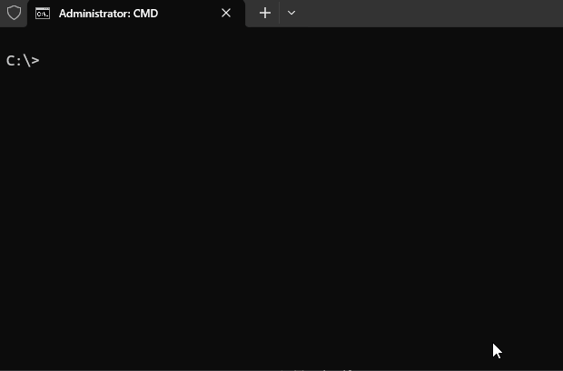

# SGA — Sistema de Gestão Acadêmica

> Gerenciamento de alunos e notas via terminal, desenvolvido em Python puro — sem dependências externas.

[](https://www.python.org/)
[](LICENSE)
[]()
---

## Demo

>  

---

## Visão Geral

O SGA permite registrar alunos, consultar notas, acompanhar desempenho e persistir os dados entre sessões, tudo pelo terminal. O projeto foi desenvolvido com foco em **separação de responsabilidades** e **robustez na entrada de dados**, mantendo cada módulo com uma única função bem definida e todo input do usuário rigorosamente validado antes de qualquer processamento.

---

## Funcionalidades

- Registrar aluno com nome e quantidade de notas personalizadas
- Buscar aluno pelo nome
- Listar todos os alunos com média e situação acadêmica
- Cálculo automático de desempenho (aprovado, recuperação ou reprovado)
- Persistência automática dos dados em `dados_alunos.json`

---

## Critério de Desempenho

| Média       | Situação       |
|-------------|----------------|
| 6.0 a 10.0  | Aprovado     |
| 4.0 a 5.9   | Recuperação  |
| 0.0 a 3.9   | Reprovado    |

---

## Destaques Técnicos

Esses pontos foram decisões conscientes de design — não apenas convenções seguidas automaticamente.

**Type hints em todas as funções**
Todas as assinaturas usam type hints (`str`, `int`, `float`, `list[float]`, `dict`), tornando o contrato de cada função explícito e o código autodocumentado sem depender de comentários.

**Separação entre `TypeError` e `ValueError`**
A validação distingue erro de *tipo* (recebeu `int` onde esperava `str`) de erro de *valor* (recebeu `str` vazia ou nota fora do intervalo). Isso permite que quem chama a função trate cada caso de forma apropriada.

**Validação na camada de entrada, não no processamento**
`helpers.py` garante que o dado chega limpo aos processadores — `processadores.py` nunca precisa se defender de input malformado. Essa separação segue o princípio de *fail fast* e mantém a lógica de negócio livre de ruído.

**Nota validada como `str`, convertida depois**
`validar_nota()` recebe `str` intencionalmente: assim é possível checar casas decimais (ex: `"8.55"` é rejeitado, `"8.5"` é aceito) antes de converter para `float` — algo impossível se o `float` já chegasse convertido.

**`json` em vez de `sqlite3`**
Ambos são stdlib. A escolha por JSON priorizou legibilidade direta do arquivo de dados e zero configuração, adequado para o escopo do projeto. A limitação (sem queries, sem índices) é reconhecida e endereçada no roadmap.

---

## Estrutura do Projeto

```
SGA/
├── main.py            # Menu interativo e loop principal
├── validadores.py     # Validação de nome, nota e lista de notas
├── processadores.py   # Lógica de negócio: registrar, buscar, listar
├── helpers.py         # Leitura e tratamento de input do usuário
├── dados.py           # Persistência: carregar e salvar em JSON
├── dados_alunos.json  # Banco de dados local (gerado automaticamente)
├── .gitignore
└── README.md
```

---

## Arquitetura

O projeto aplica o princípio de **separação de responsabilidades** — cada módulo tem uma função clara e isolada, e a dependência entre eles segue uma única direção:

```
main.py
  ├── helpers.py       →  validadores.py
  ├── processadores.py →  validadores.py
  └── dados.py
```

| Módulo              | Responsabilidade                                                           |
|---------------------|----------------------------------------------------------------------------|
| `validadores.py`    | Valida dados brutos antes de qualquer processamento                        |
| `processadores.py`  | Lógica de negócio: registrar, buscar e listar alunos                       |
| `helpers.py`        | Lê e trata o input do usuário; converte para tipos corretos                |
| `dados.py`          | Abstrai carregamento e salvamento no arquivo JSON                          |
| `main.py`           | Orquestra os módulos e exibe o menu                                        |

---

## Como Usar

### Pré-requisitos

- Python 3.10 ou superior

### Instalação

```bash
git clone https://github.com/zcypis/SGA
cd SGA
python main.py
```

Nenhuma instalação de dependências necessária — apenas Python.

---

## Testes

O projeto não possui suíte de testes automatizados ainda — está previsto como próximo passo (ver Roadmap). A validação atual é feita manualmente, cobrindo os principais casos de entrada inválida.

---

## Roadmap

Limitações atuais reconhecidas e melhorias planejadas:

- [ ] Cobertura de testes com `unittest` ou `pytest`
- [ ] Suporte a múltiplas turmas por arquivo
- [ ] Exportação de relatório em `.csv`
- [ ] Migração de `json` para `sqlite3` para suportar buscas mais complexas
- [ ] Interface web simples com Flask

---

## Tecnologias

- **Python 3.10+**
- Apenas biblioteca padrão (`json`)
- Sem dependências externas

---

## Autor

**Guilherme Xavier**

[](https://github.com/zcypis)
[](mailto:guilhermexavie3@gmail.com)
